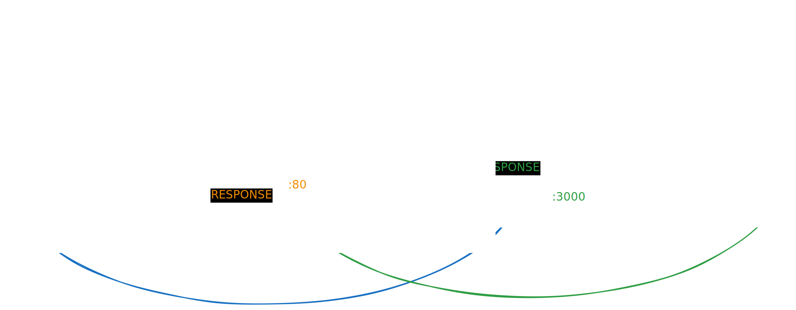

# HTTPS

1. Générer un certificat SSL cf. [Atelier 3.2](../../1-ateliers/3.2.md)
2. Copiez les certificats générés dans */ssl*
3. Renommez les certificats en *private.pem* et *certificate.crt*
4. Lancez le serveur node avec `node index.mjs`
5. Ouvrir le navigateur et accepter les alertes de sécurité lié aux certificats autosignés.

---

## Schéma application Node en production

