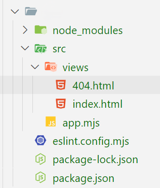
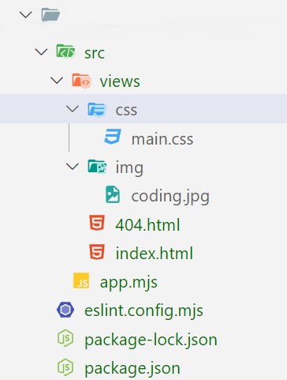

# Atelier 3.2 : serveur Web avec les fichiers Web (HTML, CSS et images)

## Enoncé 

1. Initialisez un nouveau projet avec ***npm*** en y ajoutant le module ***ESLINT***.
2. Créez un **serveur Web** qui permet de rendre le contenu d'une ***page HTML*** à partir de la route /

---

## Aides et spécifications techniques

- Le serveur écoute sur le ***PORT 3200***
- Créez un dossier *src/* contient le dossier *views/* contenant ***2 pages HTML***, ***index.html*** et ***404.html*** cf. arborescence ci-dessous
- Renvoyez la page ***index.html*** lorsqu'une requête est envoyée sur la route */*
- Renvoyez la page ***404.html*** lorsqu'une requête est envoyée sur une *autre route que /*
- Utilisez les modules ***`node:fs`, `node:http`, `node:path` et `node:url`***
- Utilisez les méthodes *resolve()* et *join()* 
pour construire vos chemins absolus et relatifs pour charger les différents 
fichiers nécessaires pour charger les différents fichiers css, images, etc.
- Vous auriez besoin de la fonction [fileURLToPath](https://nodejs.org/api/url.html#urlfileurltopathurl-options)

### Arborescence dossiers



---

## BONUS

1. Chargez un fichier ***CSS*** dans la page *index.html*
- Ajoutez un dossier `css` dans `src` dédié à l'emplacement des fichiers ***.css***
- Ajoutez le lien de votre fichier *CSS* dans la page ***index.html***
2. Faites la même en chose  pour charger dans la page ***index.html*** une image présente dans le dossier ***src/img***
3. Mettez en place un certificat SSL autosigné valable 30 jours en suivant les commandes suivantes ou en ulisant ce site [https://www.devglan.com/online-tools/generate-self-signed-cert](https://www.devglan.com/online-tools/generate-self-signed-cert). Votre serveur https écoute sur le PORT **3243**.
```bash
mkdir config
openssl genrsa -out config/server-3.2.pem 2048
# Répondez aux questions de la commande suivante ou laissez tout par défaut, ici pour les besoins d'exercice et en dev, la véracité des infos nous importe peu, par contre en production, il faudra récupérer le vrai certificat associé au nom de domaine du site en production
openssl req -new -key config/server-3.2.pem -out config/server-3.2.csr
openssl x509 -req -days 30 -in config/server-3.2.csr -signkey config/server-3.2.pem -out config/server-3.2.crt
```

### Arborescence dossiers avec le bonus

***PS: il manque le dossier config/ contenant les certificats SSL à la racine du projet dans l'image d'illustration***


