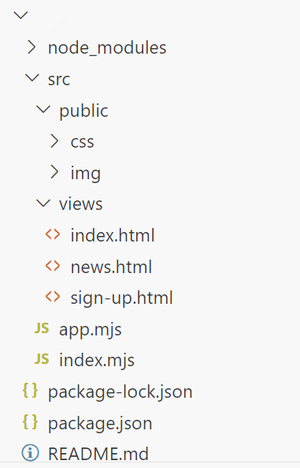

# Atelier 4.1 : Express

## Enoncé

1. Créez un nouveau projet et installez Express en tant que dépendance en exécutant les commandes suivantes :
```bash
npm init -y
npm i express
```
2. [Récupérer les pages statiques depuis ce dossier compressé](./ressources/4.1.zip) et reproduisez l'arborescence des dossiers et fichiers illustré ci-après.
3. Mettez en place les routes avec Express pour les pages suivantes :
- *connexion*
- *inscription* 
- *news*

---

## Aides et spécifications techniques 

- L'application tourne sur le ***PORT 4100***
- Toutes requêtes ci-dessous sont à faire avec la ***méthode HTTP GET***
- Pour accéder à la page de connexion, la route est `/`
- Page inscription `/sign-up`
- Page de news `/news`

### Arborescence des dossiers

