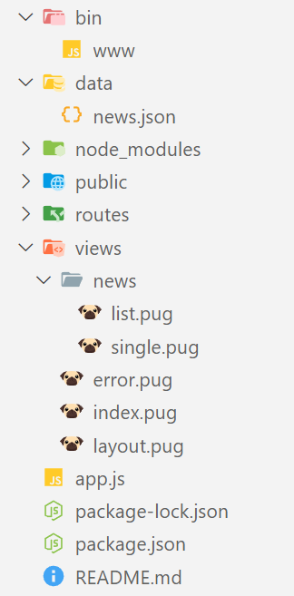

# Atelier 4.2 : routes dynamiques

## Warning

Express est codé avec le standard ***CommonJS***, il est tout à fait possible malgré tout d'écrire une application Express en utilisant le standard ***ECMAScript***. Je vous recommande d'effectuer cet exercice avec le standard ***CommonJS*** pour avoir un point de comparaison.

---

## Enoncé

1. Générez un nouveau projet avec ***Express CLI*** en utilisant le moteur de template ***pug***
- Installez ***Express CLI*** avec la commande `npm i -g express-generator`
- Exécutez la commande `express --view your_app_name` en remplacant *your_app_name* par le nom du dossier de votre choix par exemple "atelier_4.2"
2. Récupérez ces [ressources](./ressources/4.2.zip), dézippez les ressources et suivez les instructions suivantes pour les placer (cf. [arborescence finale](#arborescence-finale-du-projet)).
- Remplacez le contenu de *index.pug* par celui provenant des ressources (zip)
- Placez le dossier */data* dans le dossier */public* de votre projet Express
- Et placez uniquement le dossier */news* dans le dossier */views* d'Express
3. Mettez en place une route pour récupérer tous les articles (news) depuis le dossier */routes*
4. Mettez en place une route dynamique pour récupérer un seul article à partir de son ***ID (identifiant)*** toujours depuis le dossier */routes*

---

## Aides et spécifications techniques

- L'application tourne sur le *PORT 4200*, vous pouvez changer cette information depuis le fichier ***bin/www*** ou en utilisant un fichier *.env* à la racine de votre projet dont le contenu est :
```bash
PORT=4200
```
- La route dynamique pour une actualité est `news/:id` avec l'***ID*** correspondant à la propriété ***id*** d'une actualité présente dans ***/public/data/news.json***
- Par exemple la route dynamique pour l'article ayant l'ID 1 est ***news/1***, les informations de cet article sont récupérés depuis le fichier */public/data/news.json* et transmise et affichez dans la vue (page) ***views/news/single***

### Exemples

```js
router.get('/news', (req, res) => {
  const articles = myCustomFunctionFindAll()
  const title = 'Articles du journal lemonde'
  // Ici on transmet un objet { articles: articles, title : title } à la vue views/news/list.pug pour l'affichage
  res.render('news/list',  { articles, title })
})

router.get('/news/8', (req, res) => {
  const article = myCustomFunctionFindOne()
  res.render('news/single',  article)
})
```

### Arborescence finale du projet



### Aperçu du résultat final

#### Page news


#### Page actualité détaillée


