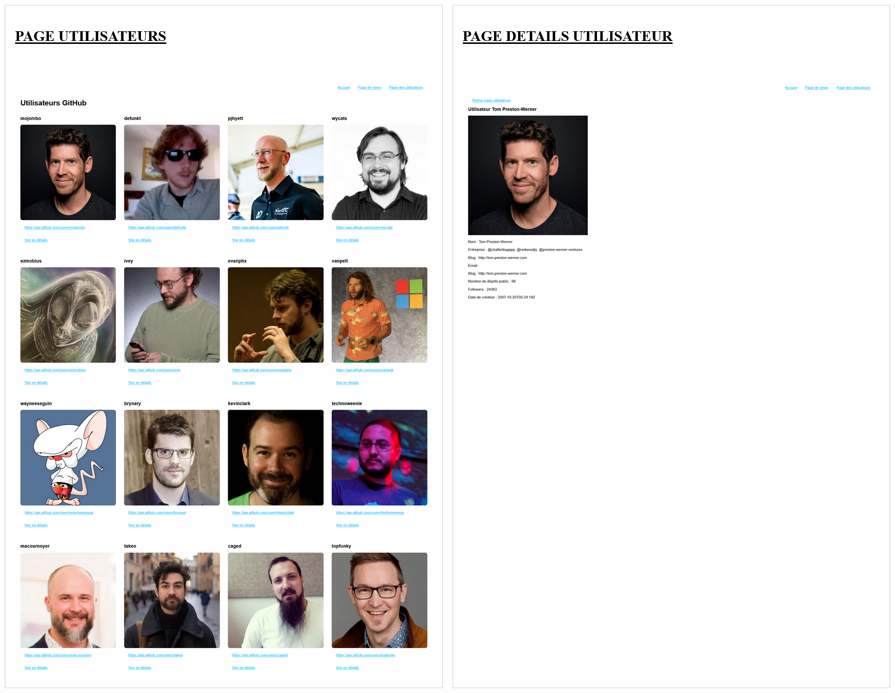

# Atelier 5.5: moteur de template

## Documentation moteurs de template

- [EJS](https://ejs.co/)
- [PUG](https://pugjs.org/api/getting-started.html)

---

## Énoncé

1. Générez un nouveau projet avec ***Express CLI*** avec le moteur de template de votre choix ***pug*** ou ***ejs***. Votre application tourne sur le ***port 5500***.
2. Mettez en place une nouvelle route permettant de lister tous les utilisateurs récupérés depuis l'[*API de GitHub* https://api.github.com/users](https://api.github.com/users) sous la forme d'une liste à puces HTML avec un lien vers la page de détails de l'utilisateur.
   1. Vous pouvez récupérer les informations de l'API à l'aide de la fonction globale ***fetch()*** ou à l'aide d'un client HTTP en utilisant la méthode ***get()*** de ***node:https***
- Exemple de l'utilisation du template *pug* au niveau des routes

```js
app.get('/users', (req, res) => {
  const users = myCustomFunctionFindAllUsers()
  const title = 'Page utilisateurs'
  // Ici l'objet { users, title } est transmis à la vue views/users/list.pug pour l'affichage
  res.render('users/list',  { users, title })
})
```

3. Mettez en place une nouvelle route permettant d'afficher un seul utilisateur à  partir d'une information unique transmise par le client (requête client)

```js
// app/:login est une route dynamique avec le placeholder :login qui sera remplacé par le login de l'utilisateur par exemple une requête vers la route /users/mojombo
app.get('/users/:login', (req, res) => {
  const user = myCustomFunctionFindOne()
  // 
  res.render('users/single',  { user })
})
```
- Aide pour récupérer le ***login*** ***req.params.login***

```js
const login = req.params.login
```

## Exemples pages finales

