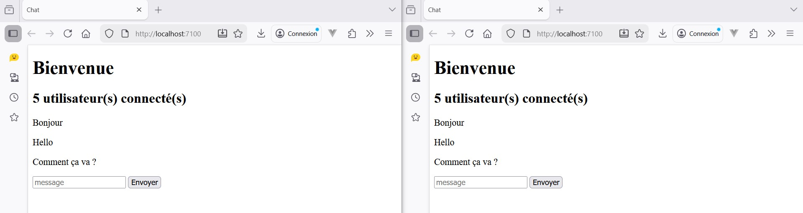

# Atelier 7.1 : Websockets

## Enoncé

1. Récupérez [ses ressources](./ressources/7.1.zip) pour la partie Front et le squelette du back.
2. Dézippez les ressources et lisez le README.md
2. Créez un ***Chat*** qui permet à des utilisateurs d'échanger des messages en temps réel en modifiant uniquement  le code dans *src/server.mjs*

## Caractéristiques

- Application tourne sur le PORT 7100
- Pour tester votre chat lancez plusieurs instances (ouvrir plusieurs onglets de votre navigateur pour avoir plusieurs utilisateurs)
- Envoyez des messages depuis le Front depuis les différentes instances

### Aperçu du chat

