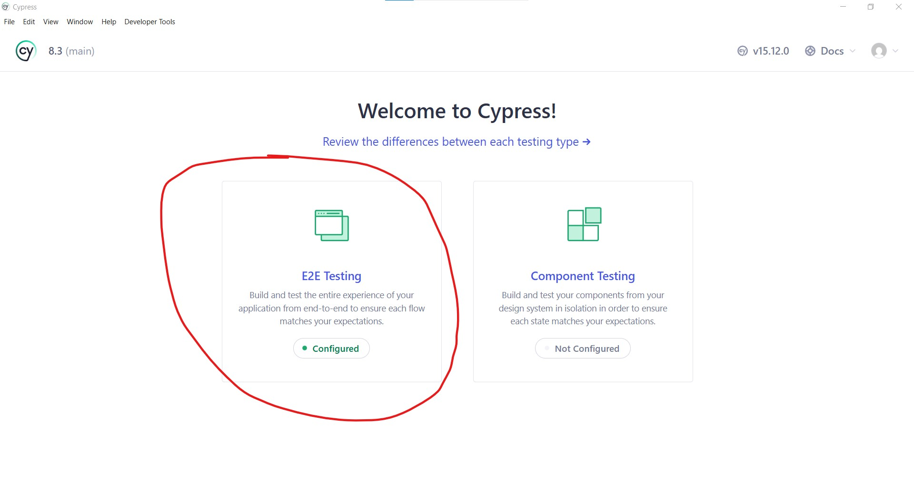
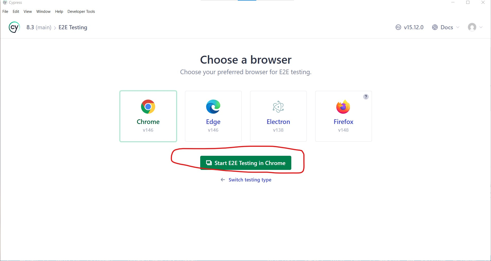
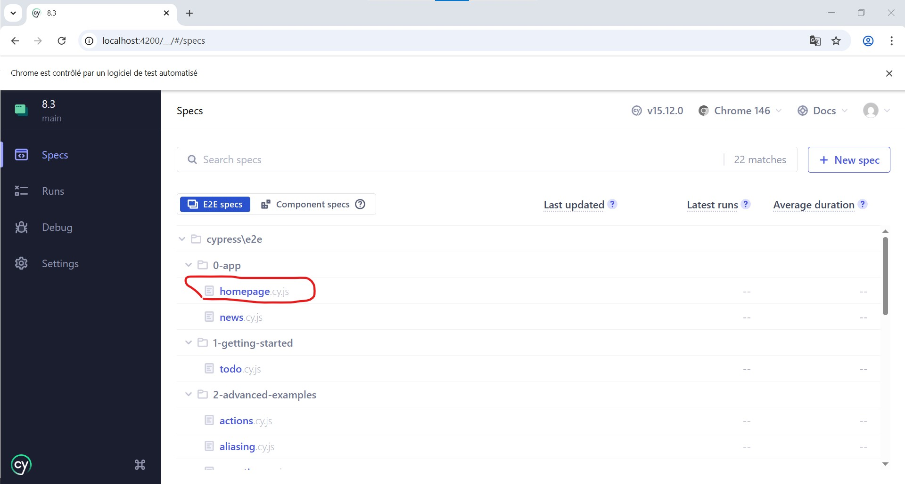
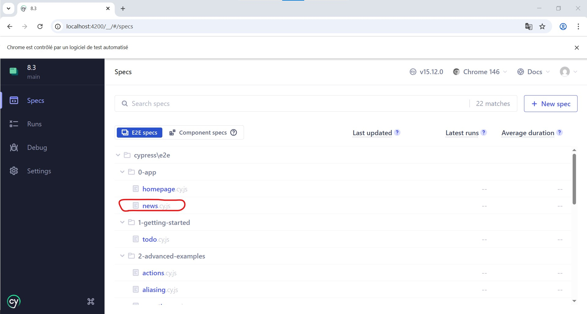
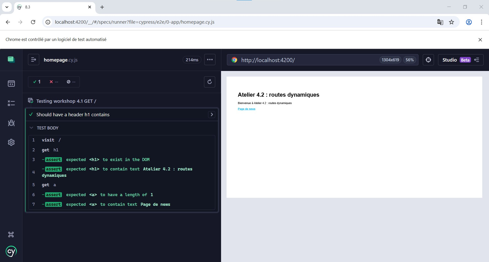
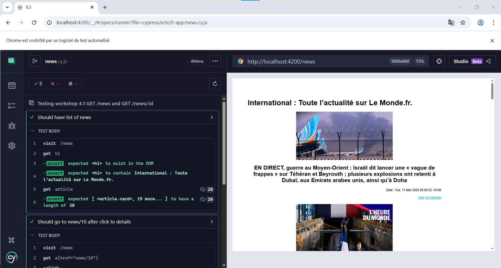

# Tests end to end de l'atelier 4.2

Pour lancer les tests fonctionnelles avec Cypress

1. Lancez le serveur de l'atelier 4.2 au préalable qui tourne normalement sur le PORT 4200, si ce n'est pas le cas pour vous, changer l'information au niveau de l'atelier 4.2 en mettant le port 4200 ou modifiez *cypress.config.js* en remplaçant le port 4200 par le port local de votre atelier 4200.
2. `npm install`
3. `npm run test:e2e`
4. En cas d'alerte du pare-feu windows, autorisez
5. Une fenêtre s'ouvre, cliquez sur E2E
6. Cliquez sur le dossier *0-app/* dans le menu de navigation de gauche et cliquez sur le fichier *homepage.cy.js* pour lancer les tests 
7. Revenez en arrière en cliquant sur le menu lateral gauche le premier icône "Specs" puis cliquez sur *news.cy.js* pour lancer également les tests.

PS : il existe un mode background sans lancer un navigateur Web pour lancer vos tests e2e et avoir des vidéos et/ou des captures d'écrans des erreurs [cf. documentation](https://docs.cypress.io/app/continuous-integration/overview)

---

## Illustrations et guide interface Cypress

---

## Résultats des tests

